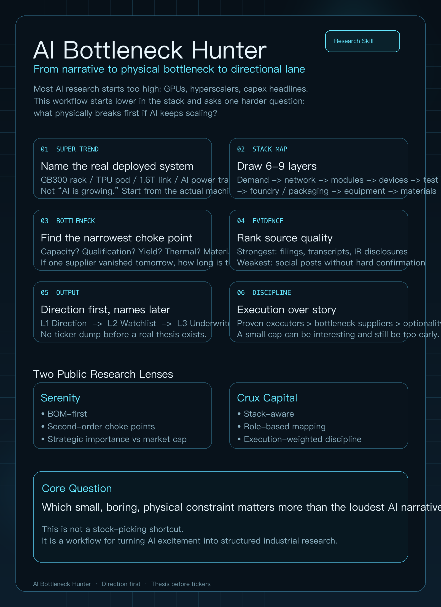

# AI Bottleneck Hunter

`AI Bottleneck Hunter` is a reusable research skill for analyzing AI infrastructure supply chains through a bottleneck-first lens.

It is inspired by two public research styles:

- **Serenity**: narrow, obsessive, bottleneck-first
- **Crux Capital**: stack-aware, basket-minded, execution-weighted

This repository does **not** copy their language or private workflow. It distills reusable research behavior:

- start from a real demand wave
- map the stack
- identify the narrowest bottleneck
- verify with earnings, reports, and industry news
- output a directional lane first
- only then surface candidate names

## What This Skill Does

This skill helps an agent or researcher answer questions like:

- What is the next AI infrastructure bottleneck?
- Which layer of the photonics / semiconductor stack is getting paid now?
- Is a bottleneck real, or just a narrative?
- Which lower-market-cap names sit closest to the bottleneck?
- How should I separate proven executors from early optionality?

## Core Design

The skill is built around a staged dialogue:

1. **L1 Sector Diagnosis**  
   Define the actual machine, deployed system, or demand wave.

2. **L2 Stack Mapping**  
   Break the chain into 6-9 layers from end demand to materials.

3. **L3 Evidence Chain**  
   Cross-check management language, industry news, reports, and supplier/customer signals.

4. **L4 Directional Lane**  
   Output the lane that matters most now.

5. **L5 Lower-Market-Cap Drilldown**  
   Only after follow-up, offer grouped candidate names with clear risk framing.

## What Makes It Different

This skill is intentionally designed to avoid common failure modes:

- It does **not** jump straight to stock picks.
- It does **not** treat AI as a magic answer machine.
- It does **not** confuse stories with validated supply constraints.
- It forces explicit separation between:
  - confirmed evidence
  - inference
  - speculation

## Repository Structure

```text
SKILL.md
agents/openai.yaml
references/
  product-manual.md
  question-ladder.md
  output-formats.md
  style-and-voice.md
docs/
  PRODUCT_CN.md
  PRODUCT_EN.md
  INFOGRAPHIC_COPY.md
```

## Key Files

- [SKILL.md](./SKILL.md): core invocation and workflow rules
- [Product Manual](./references/product-manual.md): complete usage manual
- [Chinese Product Description](./docs/PRODUCT_CN.md)
- [English Product Description](./docs/PRODUCT_EN.md)
- [Infographic Copy](./docs/INFOGRAPHIC_COPY.md)

## Usage

Example prompt:

```text
Use $ai-supply-chain-bottleneck-hunter to map the next AI infrastructure bottleneck.
Start with the directional lane only. Do not give me names yet.
```

Follow-up:

```text
Continue with $ai-supply-chain-bottleneck-hunter.
Now give me 5 names grouped by proven executor, pure bottleneck, second-order beneficiary, and early optionality.
```

## Important Boundaries

- This is a research workflow, not investment advice.
- The skill should not impersonate public figures.
- The skill should not present unverified social content as hard evidence.
- Lower-market-cap names should only appear after the thesis has been built.


## Infographic



## License

No explicit open-source license is included yet. Add one if you want this repository to be reused under defined terms.
